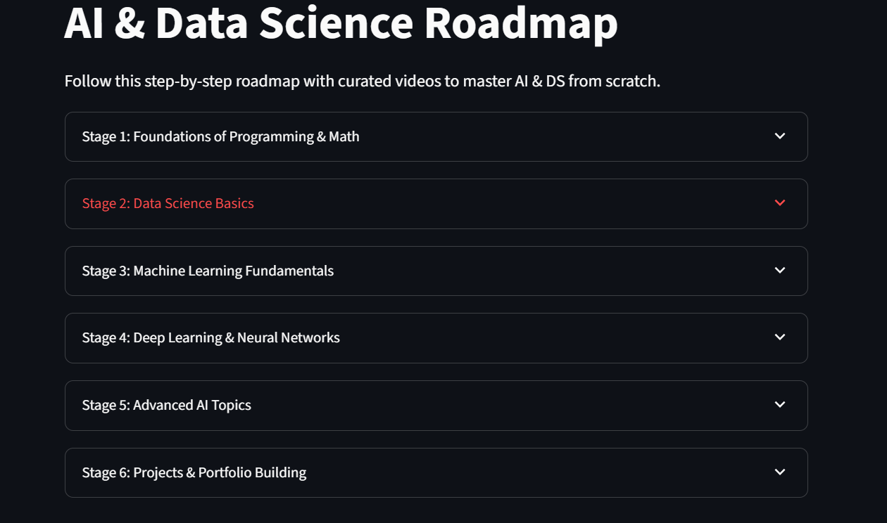
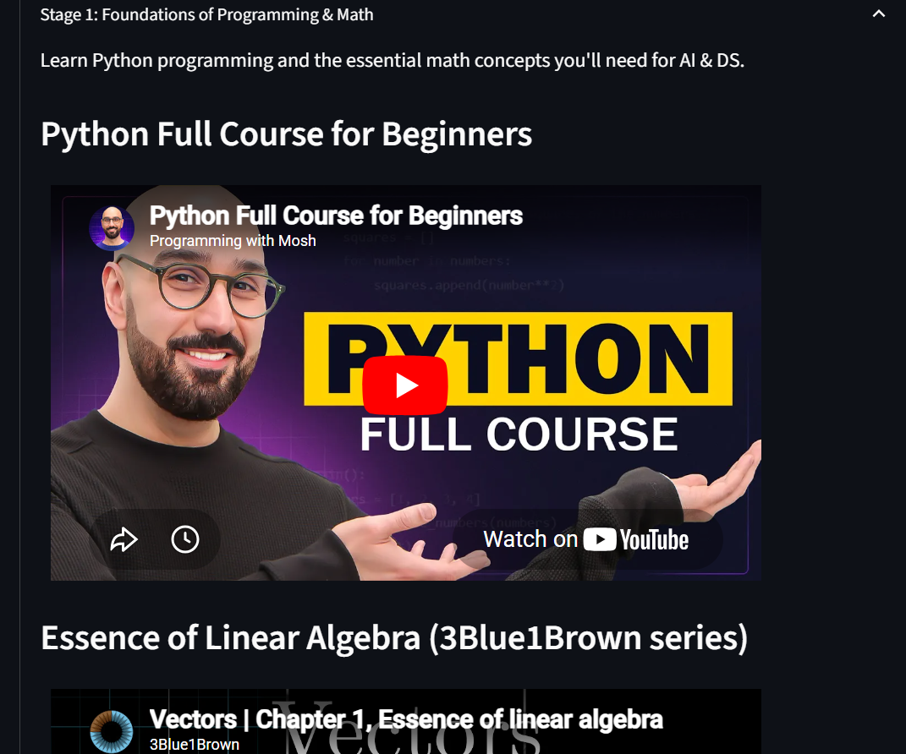

# AI & Data Science Roadmap

A small [Streamlit](https://streamlit.io/) app that lays out a step-by-step
learning path for getting into AI & Data Science. Each stage of the roadmap is
shown as an expandable panel with a short description and a handful of curated
YouTube videos, embedded inline so you can watch without leaving the page.



*A stage expanded:*



<p align="center">
  
  
  
  
</p>

## 🚀 Live demo

[👉 Open the live demo](https://nomanpathan485-learn-ai-ds.streamlit.app/)

---

## 🗺️ Roadmap stages

1. **Foundations of Programming & Math** — Python, linear algebra, probability.
2. **Data Science Basics** — Pandas, Matplotlib/Seaborn, exploratory data analysis.
3. **Machine Learning Fundamentals** — core algorithms, supervised vs unsupervised, scikit-learn.
4. **Deep Learning & Neural Networks** — TensorFlow, PyTorch, the math behind NNs.
5. **Advanced AI Topics** — NLP, computer vision, reinforcement learning.
6. **Projects & Portfolio Building** — apply it all and show your work.

---

## ✅ Requirements

- Python 3.9 or newer
- The packages listed in [`requirements.txt`](./requirements.txt):
  - `streamlit`

---

## 📦 Installation

```bash
# 1. Clone the repo
git clone https://github.com/nomanpathan485/learn-ai-ds.git
cd learn-ai-ds

# 2. (recommended) create a virtual environment
python -m venv .venv

# Windows
.venv\Scripts\activate
# macOS / Linux
source .venv/bin/activate

# 3. install dependencies
pip install -r requirements.txt
```

---

## ▶️ Running the app

From the project root:

```bash
streamlit run app.py
```

Streamlit will open the app in your default browser (usually at
<http://localhost:8501>). Edits to `app.py` are picked up automatically —
just save and the page reruns.

---

## 🧱 Project layout

```
.
├── app.py              # Streamlit app + roadmap data + rendering helpers
├── requirements.txt    # Python dependencies
├── LICENSE             # MIT license
├── .gitignore          # Files Git should ignore
└── README.md           # You are here
```

All roadmap content lives in `app.py` as a single `ROADMAP` tuple of `Stage`
objects, each containing `Video` entries. To add or replace a video, edit the
matching `Stage` and set `video_id` to the 11-character YouTube ID (the part
after `v=` in a YouTube URL).

---

## 📺 Notes on the video links

Every video ID in `app.py` was verified against the YouTube oEmbed API on
**2026-06-28** — the title returned by YouTube was cross-checked against
the slot it fills, so each video actually matches its stage's topic.

**17 verified slots** (18 entries; one duplicate removed). The original
roadmap had several wrong-topic and deleted IDs (e.g. a TEDx talk labelled
"portfolio", an unrelated 3Blue1Brown video under "linear algebra"); all
have been replaced with verified alternatives.

If a video ever goes private or gets removed, the embed will show YouTube's
own "Video unavailable" message. To fix it, find a replacement video and
update its `video_id` in `app.py`. The Python snippet below is the quickest
way to verify a candidate before committing:

```python
import urllib.request, urllib.parse, json
url = 'https://www.youtube.com/oembed?url=' + urllib.parse.quote(
    'https://www.youtube.com/watch?v=XXXXXXXXXXX'
) + '&format=json'
print(json.loads(urllib.request.urlopen(url).read())['title'])
```

---

## ⚠️ One slot intentionally left empty

Stage 6 (Projects & Portfolio) currently has **2** videos instead of 3.
The original "Machine Learning Project Ideas" entry was a Mosh tutorial
on a different topic, and no verified replacement could be found at the
time of writing. Pull requests welcome — see `ROADMAP` in `app.py`.

---

## 🤝 Contributing

Contributions are welcome! Some ideas:

- 🎥 Suggest better videos for any stage (open an issue with the link).
- ➕ Add new stages (e.g. MLOps, LLM engineering, deployment).
- 🎨 Improve the UI / add a "mark as complete" tracker per stage.
- 🐛 Fix typos or broken links.

To contribute:

1. Fork the repo
2. Create a branch: `git checkout -b feature/better-videos`
3. Commit your changes: `git commit -m "Replace broken NLP video"`
4. Push: `git push origin feature/better-videos`
5. Open a Pull Request

---

## 📄 License

[MIT](./LICENSE) — feel free to use, modify, and share.

---

## ⭐ Like it?

If this roadmap helped you or someone you shared it with, a star on the repo
goes a long way. It helps others find it too.
